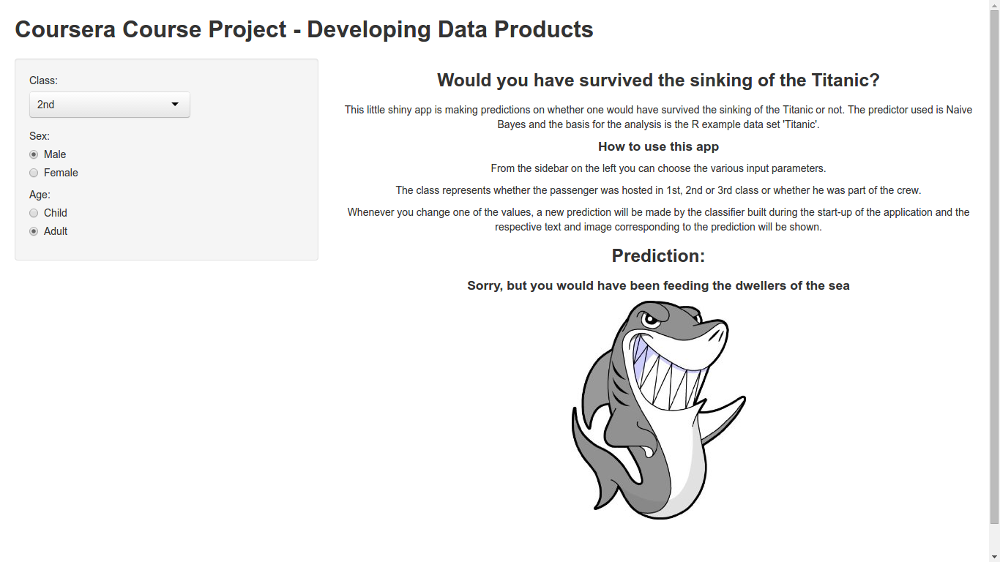

---
title       : Coursera Course Project - Developing Data Products
subtitle    : Would you have survived the sinking of the Titanic?
author      : Matthias Stierle
job         : 
framework   : io2012        # {io2012, html5slides, shower, dzslides, ...}
highlighter : highlight  # {highlight.js, prettify, highlight}
hitheme     : tomorrow      # 
widgets     : []            # {mathjax, quiz, bootstrap}
mode        : selfcontained # {standalone, draft}
knit        : slidify::knit2slides
---  
<style>
.title-slide {
  background-color: #EDE0CF; /* #EDE0CF; ; #CA9F9D*/
}

.title-slide hgroup > h1{
 font-family: 'Oswald', 'Helvetica', sanserif; 
}

.title-slide hgroup > h1, 
.title-slide hgroup > h2 {
  color: #535E43 ;  /* ; #EF5150*/
}
</style>
## Basic idea

- Choose one of the example R data sets that is suitable for making predictions

### Summary of Titanic data set

```{r,echo=FALSE}
summary(as.data.frame(Titanic))
```
&#8594; Predict whether one would have survived the sinking of the Titanic

--- .class #id 
## Choose a learning algorithm
- As all the predictor variables (Sex, Age and Class) are factors we can make use of a rule-based algorithm.
- Therefore we choose naive bayes contained in the e1071 package

#### Load Package and built classifier
```{r,echo=TRUE,results='hide'}
library(e1071)
classifier <- naiveBayes(Survived ~ ., data = Titanic)
```
#### Example
```{r,echo=FALSE}
example <- data.frame(Titanic)[1,1:3]
example
```
#### Predict on example
```{r,echo=TRUE}
predict(classifier,example)
```


--- .class #id 
## Layout
### Sidepar Panel
- A sidepar panel for defining the 3 input variables: Sex, Age and Class
- A dropdown for class as we have more than 2 options
- Radio Buttons for Sex and Age as we have only 2 options for each

### Main Panel
- A short description of the app
- A short documentation/manual how to use the app
- The result of the prediction including an image

--- .class #id 
## The result

- The app can be found on https://supamuc.shinyapps.io/myApp/


